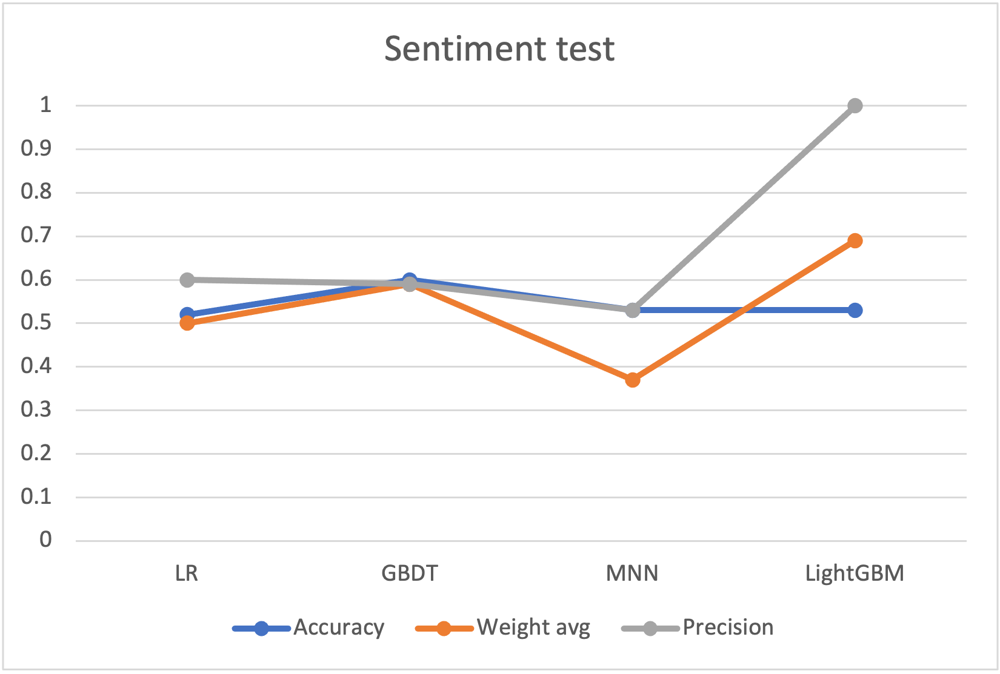

# Eluvio_DS_challenge

- Data processing and data analysis
- Create word2vec embeddings for titles
- Predict the attracting news based on up_vote feature
- Predict the sentiment based on title
- Recommand reader another news

# First Task
There are 8 columns in this dataset, ['time_created'、'date_created'、'up_votes'、'down_votes'、'title'、'over_18'、'author' and 'category']. 
For this open challenge, the feature ['up_votes'] can be a predictind label that we focus on whether the news is attracting or not.
This work will be useful if we know how attractive news is, we can create more business opportunities for those products.
In this problem, the news can be easily split to be two parts - attracting news & not attracting news.
In the feature selection, I drop ['down_votes'] and ['category'] first, since they are all "0" and all "worldnews" and it is useless.
In addition, I do the feature selection by featrue importance in lightGBM classfier and it shows ['time_created'], ['date_created'] are effect for prediction ['up_votes'], so I keep them.
['title'] and ['over_18'], are the factors since if the title is attracting, there should be more people to read and more probably to like it and also age will sometimes determine their interest
"authors" may be an useful feature since some famous actor will be more likely to get likeness.
There are 85838 authors in the data, thus, I used label encoding oh this feature.
Finally, I use ['title'], ['over_18'], ['authors'] to simplify the problem.

For the text processing, I use nltk package on ['title'] and then use Word2Vec to generate 50 vectors for each title.
In the experiment, I design two model tasks. One is let title divide into 5 levels - [extremely attractive],[attractive],[neutral],[not attractive],[extremely not attractive].
Another is just in two classes - [attractive] and [not attractive], here I set the threshold to be 100.
Next, I split data for 80% training data and 20% testing data. 

In the first experiment, I used torch.nn to predict these 5 levels and finally got 0.43 F1-score with 1.0 precision.
In the second experiment,the result shows 0.9 accuracy on LR, GBDT and MNN models with 0.86 weight average and 0.9 precision.
On the other hand, lightGBM model has 0.9 accuracy with 0.95 weight average and 1.0 precision, which is highest above all.

For the conclusion, we can see that all the simple machine learning model shows that the ['title'], ['over_18'], ['authors'], have a very strong relationship with ['up_votes'].

# Second Task
Same way as first task for word tokenize and use nltk.sentiment.vader to generate new label as ['sentiment'].
Next, using tokenized['title'] to predict whether ['sentiment'] is positive(y=1) or negative(y=0).

For the conclusion, since currently we don't have the true label on this dataset, we just use self labelled dataset for sentiment from nltk.
The accuracy is not to high (around 0.5~0.6). Thus, we try the pre-trained from Bert model. 
Although the dataset is larget and my personal computer cannot handle it, the Bert pre-trained model get 0.91 high accuracy after training 2000 data.
Hence, we think the sentiment test can have better result in this dataset if we have advance equipment.

# Third Task
First, find the time earlier than current time for news i. Next, define whether this news is over 18. If false, choose all news which are also under 18. If True, choose all news. Then, find whether there are same author as news i, if yes, choose top 1 up_votes news; if no, choose top 1 up_votes news from diffent authors.

